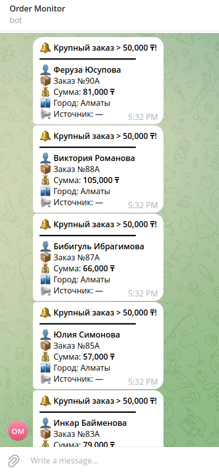

# Retail Dashboard — Тестовое задание AI Tools Specialist

Мини-дашборд заказов: RetailCRM → Supabase → Vercel + Telegram-уведомления.

**[Живой дашборд →](https://retail-dashboard-beta.vercel.app)**

---

## Стек

| Слой | Технология |
|---|---|
| CRM | RetailCRM (демо-аккаунт) |
| База данных | Supabase (Postgres) |
| Фронтенд | HTML + Chart.js + Supabase JS |
| Деплой | Vercel (статика) |
| Уведомления | Telegram Bot API |
| Скрипты | Python 3.12 + requests + python-dotenv |
| Тесты | pytest |

---

## Архитектура

```
mock_orders.json
      │
      ▼
import_to_crm.py ──────► RetailCRM API
                                │
                                ▼
                    sync_to_supabase.py ──► Supabase (таблица orders)
                                │                    │
                                ▼                    ▼
                         Telegram Bot          dashboard/index.html
                     (заказы > 50 000 ₸)      (Chart.js, live data)
                                                     │
                                                     ▼
                                                  Vercel
```

---

## Промпты, которые давал Claude Code

### Промпт 1 — общий план проекта
```
Тестовое задание AI Tools Specialist. Нужно построить мини-дашборд заказов.
Стек: RetailCRM, Supabase, Vercel, Telegram Bot. Давай обсудим план
реализации прежде чем начнём.
```
**Результат:** Получил полный план по шагам, структуру файлов, порядок работы.

---

### Промпт 2 — инициализация проекта
```
Подготовь структуру проекта:
- .env с переменными для RetailCRM, Supabase, Telegram
- .gitignore (Python + Node)
- .editorconfig
- .vscode/settings.json чтобы VSCode подхватил venv
- requirements.txt без версий (поставим свежие, потом зафризим)
```
**Результат:** Все конфиги готовы, .vscode/settings.json настроен на venv.

---

### Промпт 3 — скрипт импорта в RetailCRM
```
Выступи в роли Senior Python Developer. Напиши скрипт import_to_crm.py:
- Читает mock_orders.json
- Перед отправкой запрашивает у CRM доступные сайты и статусы
- Отправляет каждый заказ через POST /api/v5/orders/create
- Ключ API и настройки из .env
- time.sleep между запросами чтобы не получить rate limit
- Подробный вывод в консоль
```
**Результат:** Скрипт с автоопределением site_code и фильтрацией полей.

---

### Промпт 4 — схема Supabase
```
Напиши SQL для создания таблицы orders в Supabase.
Нужны поля: crm_id (уникальный), customer_name, phone, email,
total_sum, status, city, utm_source, created_at, alert_sent.
Добавь RLS policy для публичного чтения (нужно для дашборда).
```
**Результат:** Готовый SQL, выполнен в Supabase SQL Editor за один раз.

---

### Промпт 5 — скрипт синхронизации + Telegram
```
Напиши sync_to_supabase.py:
- Забирает все заказы из RetailCRM (с пагинацией)
- Делает upsert в Supabase по crm_id
- После синхронизации находит заказы с total_sum > 50000 и alert_sent=false
- Отправляет Telegram-уведомление для каждого
- Помечает alert_sent=true чтобы не спамить повторно
- Все пороги и ключи из .env
```
**Результат:** Скрипт в 3 этапа, идемпотентный (можно запускать повторно).

---

### Промпт 6 — дашборд
```
Напиши dashboard/index.html — статическая страница без бэкенда:
- Данные напрямую из Supabase через @supabase/supabase-js
- Bar chart заказов по дням (Chart.js)
- Doughnut chart по источникам (utm_source)
- 4 stat-карточки: заказы, выручка, средний чек, крупные заказы
- Таблица последних 25 заказов
- Тёмная тема, адаптивная вёрстка
- Заказы > 50 000 ₸ подсвечиваются зелёным
```
**Результат:** Полностью рабочий дашборд, деплоится на Vercel как статика.

---

### Промпт 7 — тесты
```
Напиши тесты:
1. test_connections.py — smoke-тесты: проверяем что RetailCRM, Supabase
   и Telegram API доступны и ключи валидны. Telegram-тест реально отправляет
   сообщение боту.
2. test_transform.py — unit-тесты для функции build_row: маппинг полей,
   расчёт суммы из items когда totalSumm=0, обработка None-полей, порог 50k.
   Эти тесты офлайн, без внешних API.
```
**Результат:** 25 тестов, все зелёные.

---

## Нюансы, которые обнаружились в процессе

### 1. RetailCRM: `limit` только 20 / 50 / 100
Тест использовал `limit=1` — CRM вернул 400. Исправлено на `limit=20`.

### 2. RetailCRM: нужен `site` код
При создании заказов API возвращал `Order is not loaded` без параметра `site`.
Решение: скрипт сначала запрашивает `GET /reference/sites` и берёт первый код.

### 3. RetailCRM: `orderType` и `customFields` отклоняются
В демо-аккаунте нет преднастроенных типов заказов и кастомных полей.
Решение: отправляем только базовые поля (имя, телефон, email, items, delivery).

### 4. utm_source попал в Supabase отдельным шагом
Поскольку `customFields` убрали из CRM-импорта, `utm_source` взяли напрямую
из `mock_orders.json` и записали в Supabase по совпадению телефона
(`scripts/patch_utm.py`).

### 5. Supabase: новый формат ключей `sb_publishable_*`
Вместо JWT-ключей Supabase теперь использует `sb_publishable_*` и `sb_secret_*`.
Работают так же — в заголовках `Authorization: Bearer` и `apikey`.

---

## Локальный запуск

```bash
# 1. Клонировать репо
git clone https://github.com/Alvsok/retail-dashboard.git
cd retail-dashboard

# 2. Виртуальное окружение
python -m venv venv
source venv/bin/activate

# 3. Зависимости
pip install -r requirements.txt
pip install pytest pytest-mock  # для тестов

# 4. Создать .env (см. .env.example ниже)
cp .env.example .env
# заполнить своими ключами

# 5. Создать таблицу в Supabase
# Открыть supabase/schema.sql и выполнить в SQL Editor

# 6. Запустить тесты
pytest tests/ -v

# 7. Импорт заказов в CRM
python scripts/import_to_crm.py

# 8. Синхронизация + Telegram-алерты
python scripts/sync_to_supabase.py
```

---

## Структура проекта

```
retail-dashboard/
├── .env.example              # шаблон переменных окружения
├── .gitignore
├── .editorconfig
├── requirements.txt          # зафриженные зависимости
├── mock_orders.json          # 50 тестовых заказов
├── scripts/
│   ├── import_to_crm.py      # Шаг 2: загрузка в RetailCRM
│   ├── sync_to_supabase.py   # Шаг 3: CRM → Supabase + Telegram
│   └── patch_utm.py          # одноразовый: дописать utm_source
├── supabase/
│   └── schema.sql            # DDL таблицы orders
├── dashboard/
│   └── index.html            # веб-дашборд (Chart.js + Supabase JS)
├── vercel.json               # outputDirectory: dashboard
└── tests/
    ├── test_connections.py   # smoke-тесты API
    └── test_transform.py     # unit-тесты трансформации данных
```

---

## Скриншот Telegram-уведомления



---

## Ссылки

- **Дашборд:** https://retail-dashboard-beta.vercel.app
- **GitHub:** https://github.com/Alvsok/retail-dashboard
